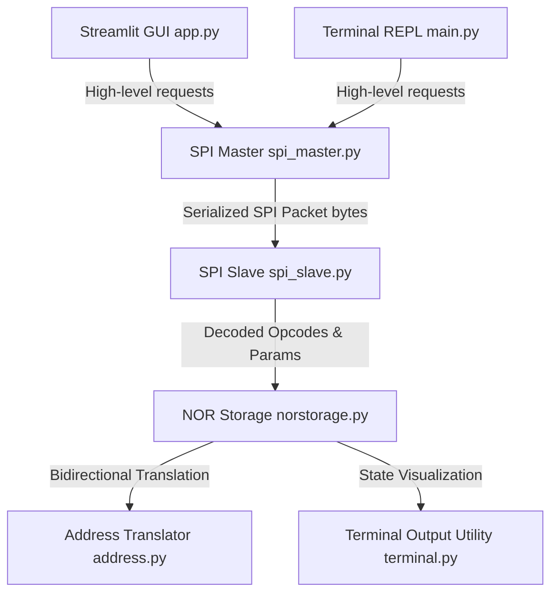

# Project Report: Architecture & Implementation of a NOR Flash Memory Simulator

## 1. Introduction & Project Objective

The objective of this project is to develop a functional, modular, and educational Python-based simulator for a **64KB NOR Flash memory device** coupled with a simulated **SPI (Serial Peripheral Interface) communication protocol stack**. 

This simulator models the functional behavior of a NOR flash device, including the physical constraints of NOR memory cells (such as write-propagation rules) and simulated hardware latencies. The interface is visualized through both a command-line REPL and an interactive Streamlit GUI. It is designed for architecture exploration, firmware debugging support, and educational visualization of memory operations.

---

## 2. System Architecture

The project is structured around a decoupled **4-Layer Architecture** that mimics a real physical system. This ensures that changing the user interface does not affect the communication protocol, and modifying the protocol details does not affect the core memory array logic.



### 2.1 The Four Layers
1. **User Interface Layer (`main.py` & `gui/app.py`)**: Displays the memory grid, records transactions, and provides buttons/inputs for users.
2. **SPI Master Controller (`spi/spi_master.py`)**: Emulates the host microcontroller's SPI controller. It takes high-level operations (e.g., "Write AA BB to address 0x0000") and encodes them into standard SPI transaction packets.
3. **SPI Slave Interface (`spi/spi_slave.py`)**: Emulates the NOR flash on-chip controller. It receives serialized byte packets, parses opcodes, checks packet integrity, simulates clock-cycle transfer overhead, and dispatches requests to the memory array.
4. **NOR Storage Core (`storage/norstorage.py`)**: Simulates the physical memory storage array, enforcing page-boundary constraints, timing delays, and NOR-cell write/erase behaviors.

---

## 3. Core Component Implementation Details

### 3.1 Bidirectional Address Translation (`utils/address.py`)
To emulate memory organization, the 64KB array is physically arranged as a **4D coordinate system**:
$$\text{Block} \rightarrow \text{Sector} \rightarrow \text{Page} \rightarrow \text{Byte Offset}$$

The simulator configuration defines:
- **Blocks**: 4
- **Sectors per Block**: 4
- **Pages per Sector**: 16
- **Bytes per Page**: 256
- Total Capacity: $4 \times 4 \times 16 \times 256 = 65,536 \text{ bytes (64 KB)}$

#### Math Formula:
Given a linear flat address $A \in [0, 65535]$:
$$\text{Block Size } (S_B) = \text{Sectors/Block} \times \text{Pages/Sector} \times \text{Bytes/Page} = 16,384 \text{ B}$$
$$\text{Sector Size } (S_S) = \text{Pages/Sector} \times \text{Bytes/Page} = 4,096 \text{ B}$$
$$\text{Page Size } (S_P) = \text{Bytes/Page} = 256 \text{ B}$$

The coordinates are extracted using integer division and modulo math:
$$\text{Block} = A \div S_B$$
$$\text{Sector} = (A \pmod{S_B}) \div S_S$$
$$\text{Page} = (A \pmod{S_S}) \div S_P$$
$$\text{Offset} = A \pmod{S_P}$$

Conversely, the linear address is reconstructed as:
$$\text{Linear Address} = (\text{Block} \times S_B) + (\text{Sector} \times S_S) + (\text{Page} \times S_P) + \text{Offset}$$

---

### 3.2 NumPy-Backed Storage Array & NOR Constraints (`storage/norstorage.py`)
The memory contents are managed via a multidimensional NumPy array initialized to `0xFF` (representing the erased state of a floating-gate transistor where the gate holds no trapped electrons):
```python
self.norarray = np.full((blocks, sectors, pages, bytes), 0xFF, dtype=np.uint8)
```

#### The NOR Bit-Transition Rule:
NOR flash cells can only transition from charge-state **1 to 0** during programming. Changing a bit from **0 to 1** requires exposing the entire block to high voltage, resetting all cells back to `1` (`0xFF`).

To program incoming bytes, the simulator performs a bitwise **AND** between the existing flash byte and the new byte:
$$\text{New Value} = \text{Old Value} \ \& \ \text{Incoming Byte}$$

If $\text{New Value} \neq \text{Incoming Byte}$, it implies that the write operation attempted an illegal `0` to `1` transition. The simulator programs the cell using the AND result anyway (matching real hardware behavior) and logs a warning:
```python
new_value = old_value & incoming_byte
if new_value != incoming_byte:
    illegal_transitions += 1
```

---

### 3.3 SPI Protocol Packets & Physical Bus Timing (`spi/`)
The Master and Slave exchange bytes using standard commands:

| Command | Opcode | Packet Structure | Description |
|---|---|---|---|
| **READ** | `0x03` | `[0x03][Addr MSB][Addr Mid][Addr LSB][Length]` | Reads up to 256 bytes |
| **WRITE** | `0x02` | `[0x02][Addr MSB][Addr Mid][Addr LSB][Data_0 ... Data_N]` | Programs bytes |
| **ERASE** | `0xD8` | `[0xD8][Block ID]` | Erases block (sets to 0xFF) |
| **READ STATUS** | `0x05` | `[0x05]` | Returns busy flags |

#### Physical Bus Timing Simulation:
Bus timings are calculated dynamically using the configured SPI frequency (`spi_clock_mhz` in `config.json`) and the physical bus width parameters for standard SPI, QSPI, and Octal SPI:

1. **Clocks Per Byte**:
   - **Standard SPI**: 1-bit bus $\rightarrow$ 8 clock cycles per byte.
   - **QSPI**: 4-bit bus $\rightarrow$ 2 clock cycles per byte.
   - **Octal SPI**: 8-bit bus $\rightarrow$ 1 clock cycle per byte.

2. **Transmission Delay Formulas**:
   The transmission delay is calculated using the total number of bits transferred (including command request packets and response packets), the physical bus width, and the configured SPI clock frequency.
   
   - **Total Transmitted Bits ($B_{\text{Total}}$)**:
     $$B_{\text{Total}} = (\text{Request Packet Bytes} + \text{Response Packet Bytes}) \times 8$$
     
   - **Effective SPI Clock Cycles ($C_{\text{Effective}}$)**:
     $$C_{\text{Effective}} = \frac{B_{\text{Total}}}{\text{Bus Width}}$$
     Where $\text{Bus Width}$ is $1$ for Standard SPI, $4$ for QSPI, and $8$ for Octal SPI.
     
   - **Mathematical SPI Bus Delay ($t_{\text{SPI}}$ in milliseconds)**:
     $$t_{\text{SPI}} = \frac{C_{\text{Effective}}}{f_{\text{SPI}}} \times 1000$$
     Where $f_{\text{SPI}}$ is the SPI clock frequency in Hz (loaded from `spi_clock_mhz` in `config.json`).

3. **Mitigation of Windows Timer Tick Jitter**:
   On Windows operating systems, the standard system thread scheduler has a default timer tick resolution of **15.6 ms**. Standard timing functions (such as `time.sleep()`) are bound by this limit. If the simulator attempted to sleep for microsecond-scale physical bus delays (e.g. 0.8 ms for standard SPI, 0.2 ms for QSPI, or 0.1 ms for Octal SPI), the OS would yield the execution slice, causing the sleep to take at least 15.6 ms.
   
   This thread-scheduling jitter would make QSPI or Octal SPI occasionally appear slower than Standard SPI in tests, and would obscure the actual performance scaling of the bus widths.
   
   To solve this, the simulator implements **mathematical delay modeling** instead of physical sleeping for bus transmissions:
   - The bus transmission delay ($t_{\text{SPI}}$) is calculated mathematically using the formulas above.
   - This delay is directly aggregated with the flash operation duration ($t_{\text{Flash}}$) and logging rendering time ($t_{\text{Print}}$).
   - In the Streamlit GUI, metric values and transaction logs retrieve these subtask durations directly from the simulated log database in `st.session_state` rather than measuring overall web execution elapsed times. This guarantees jitter-free, monotonic, and physically precise latency scaling (Standard SPI > QSPI > Octal SPI) under all environments.

---

### 3.4 SPI Waveform Visualization Module (`utils/waveform.py`)
To provide deep, hardware-level visibility into SPI bus transactions, the simulator includes a custom SVG waveform generator. This module programmatically constructs visual timing diagrams showing chip-select (CS#), clock (CLK), and data line activity.

#### Features & Layout Architecture:
- **Zero-Dependency Vector Output**: Generates raw, standard SVG strings directly without external graphic libraries. This ensures lightweight execution and seamless Streamlit embedding via HTML.
- **Adaptive Width & Spacing**:
  - **Standard SPI (1-bit)**: Visualizes bit-level timing. Renders high/low digital transitions for each bit (8 clocks per byte) on separate `MOSI` and `MISO` lines with individual bit annotations (`0` or `1`).
  - **QSPI (4-bit)**: Collapses the 4-data-line bus into a single hexagonal-slot lane showing hexadecimal nibble values (`0` to `F`), requiring 2 clocks per byte.
  - **Octal SPI (8-bit)**: Collapses the 8-data-line bus into hexagonal slots showing full byte values (`00` to `FF`), requiring 1 clock per byte.
- **Interactive Phase Layering**: Maps high-level transaction phases (such as `OPCODE`, `ADDR`, `LEN`, `DATA`, `BLOCK`, and `RESP`) as color-coded block indicators directly above the clock signal.
- **Visual Signals**:
  - **CLK**: Renders active square-wave pulses only during active bus cycles; stays flat at logic-low during idle periods.
  - **CS#**: Renders active-low select transitions (dropping to low before active CLK and pulling back high after transaction completion).
- **Auto-Truncation**: Long data transfers are truncated to a maximum display limit (scaled dynamically per bus width) with standard ellipsis (`...`) indicators, keeping diagrams clear and readable.

---

## 4. Execution Timing & Latency Breakdown Model

To visualize and debug performance bottlenecks, the simulator splits the total execution time of every operation into three subtasks using high-precision timers (`time.perf_counter()`):

1. **SPI Bus & Controller Overhead ($t_{\text{SPI}}$)**:
   The simulated time spent clocking the bits over the bus wires (calculated using the formula in section 3.3).
2. **Flash Operation Latency ($t_{\text{Flash}}$)**:
   The pure physical operational latency of the memory cell arrays (emulated via `time.sleep` based on `config.json`) plus actual cell-write array updates.
3. **Console Logging & Rendering ($t_{\text{Print}}$)**:
   The actual CPU time spent formatting the hex grid layout, color-coding log details, and printing updates to the terminal screen.

#### Calculation & State Propagation:
To eliminate Python JIT compiler warmth overhead and Streamlit page-rerun rendering thread scheduler jitter:
- **Storage operations** measure $t_{\text{Flash}}$ and $t_{\text{Print}}$ independently.
- **The SPI Slave** calculates $t_{\text{SPI}}$ mathematically and computes the overall deterministic transaction duration:
  $$t_{\text{Total}} = t_{\text{SPI}} + t_{\text{Flash}} + t_{\text{Print}}$$
- **The Streamlit GUI** reads these logged subtask durations directly from `st.session_state` rather than measuring overall web execution residuals, ensuring exact monotonic latency differences.

These breakdowns are presented dynamically in both command-line trace blocks and interactive Streamlit metric tables.

---

## 5. User Interface Implementations

### 5.1 Interactive Terminal REPL (`main.py`)
A fast interactive terminal loop that reads user input commands (e.g., `r 0x0000 16`), calls the SPI Master layer, formats results in colorized blocks, and displays color-coded operation results. Separators prevent visual clutter on Windows consoles.

### 5.2 Streamlit Dashboard (`gui/app.py`)
An interactive dashboard optimized for state preservation.
- **State Management**: Uses Streamlit's `st.session_state` to persist the simulated NOR array and SPI controller instances across application reruns (preventing reinstantiation upon user interactions).
- **Tab Layout**:
  - **Read/Write/Erase Panels**: Forms with validation checking.
  - **Memory Viewer**: Provides a clean look at the memory grid with metrics showing erased capacity vs programmed capacity.
  - **Transaction History**: Displays detailed logs of all actions with timing breakdowns showing subtask allocations.
  - **SPI Waveform Viewer**: Provides interactive visualization of SPI signal transitions (CLK, CS#, MOSI/DATA, MISO/DATA) for individual transactions. Helps users inspect bit-by-bit or cycle-by-cycle command and data transfers.
